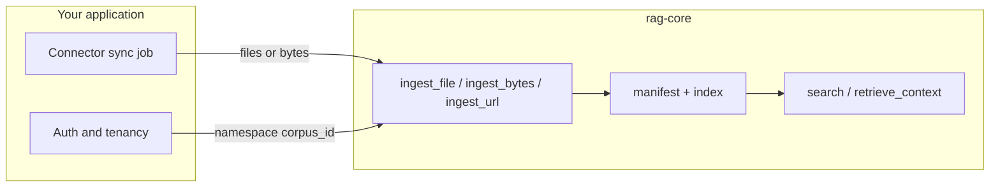

# Connector pattern (app-owned)

Managed RAG products ship Drive/Notion/S3 connectors inside their cloud. **rag-core does not.** Your app runs sync jobs; rag-core ingests bytes and URLs you already fetched.

## Pattern



1. **Sync** — Your worker lists or watches the external system (Drive, Notion, CRM, etc.) and downloads content you are allowed to store.
2. **Bind tenancy** — Map each document to `namespace` + `corpus_id` + stable `document_key` before ingest.
3. **Ingest** — Call `ingest_file`, `ingest_bytes`, or `ingest_url` (with your fetch client for remote sources).
4. **Manifest** — rag-core records versions; use manifest APIs when you need incremental updates or deletes.
5. **Retrieve** — Chat/agents call `retrieve_context` with the same namespace/corpus scope.

## Example: file drop after sync

```python
document = await core.ingest_file(
    path=downloaded_path,
    namespace=f"tenant:{tenant_id}",
    corpus_id="notion-workspace",
    document_key=notion_page_id,
)
```

## Example: URL with your fetch policy

```python
document = await core.ingest_url(
    url,
    namespace=namespace,
    corpus_id=corpus_id,
    fetch_client=your_hardened_client,
)
```

Use `rag_core.fetch_security` helpers to block private-network fetches in production.

## Deletes and updates

When a source document is removed upstream:

1. Delete or tombstone in your app database.
2. Call rag-core delete/reindex APIs for that `document_id` in the same namespace/corpus.

Do not rely on implicit connector garbage collection — there is no hosted connector state.

## What not to build in rag-core

- OAuth flows per SaaS connector
- Webhook receivers for vendor-specific events
- Connector marketplace UI

See [production-guide.md](production-guide.md) for worker lifecycle and [../self-host/quickstart.md](../self-host/quickstart.md) if you expose HTTP instead of embedding.
