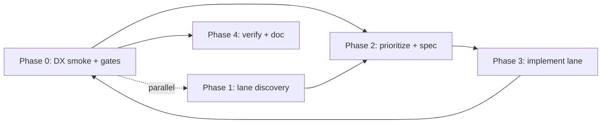

# DX + self-host subagent program

> **Archived.** Journey C content is landed; use [one-repo-retrieval-engine-strategy.md](../one-repo-retrieval-engine-strategy.md) and [../../scripts/README.md](../../scripts/README.md).

**Give this file to a new agent when the goal is product quality and developer experience—not git hygiene, PR closure, or contributor stats.**

**Strategy parent:** `docs/plans/one-repo-retrieval-engine-strategy.md` — managed-RAG escape + OSS steal/refuse. Self-host/DX is **Journey C** only; do not treat compose/quickstart as the whole product.

Before implementing anything from this file, complete the parent plan's **Shape Gate**. The current Journey C best shape is **C3: API contract first** (OpenAPI + stable errors + rich health), then **C2: full compose with `serve`** after the API contract is stable.

GitHub may still list old contributors after force-push; that is expected. A future **delete repo → recreate same name → push clean `main`** is acceptable and out of scope here.

---

## North star

**Developers should go from zero to a working self-hosted retrieval stack in one sitting**, with obvious next steps for production (persistent Qdrant, API keys, observability).

Priority order:

1. **DX** — time-to-first-success, error messages, defaults, copy-paste paths
2. **Self-host** — `serve`, compose, env templates, job lifecycle clarity
3. **Contracts** — stable JSON shapes (`expectations.md`, tool contracts, HTTP)
4. **CI signal** — fewer, sharper gates; not more pytest count
5. **Code quality** — only where it improves the above

---

## Current gaps (honest)

| Area | Today | Pain |
|------|--------|------|
| First run | `demo` + `local-search` | Good for library; weak story for **HTTP self-host** |
| Self-host | `rag-core serve` + Qdrant compose + HTTP journey tests | API contract, errors, health, and auth recipe are still thin |
| Docs | README + self-host quickstart | Journey C exists; Journey A/B still need best-shape execution |
| CI | ruff + mypy + **full pytest × 2 Pythons** | No tiering; no DX smoke; `eval` workflow mostly redundant with markers |
| Tests | ~1900 tests | Many **log-sanitization clones** and contract duplicates; high count ≠ high signal |
| Review doc | `cursor-agent-review-strategy.md` | Tuned for **merge review @ SHA**, not product lanes |

---

## Subagent protocol (mirror review strategy)

Same discipline as merge review: **coordinator adjudicates**; subagents are read-only unless a lane owner is fixing.



### Phase 0 — Coordinator (always)

- Run **golden path** manually (or script): clone → `uv sync` → `demo` → `local-search` → `serve` health → one ingest job → one search (no keys where possible).
- Run **fast gates** only: `ruff`, `mypy`, `pytest -m "not slow"` (once markers exist).
- Record failures as **DX defects** (P0 = blocks golden path), not review nits.

### Phase 1 — Discovery (≤6 read-only subagents, max 8 findings each)

Use the same `HANDOFF` block as `cursor-agent-review-strategy.md`, but swap `SCOPE_BLOCK`:

| ID | SCOPE_BLOCK |
|----|-------------|
| S1 | **Self-host runtime**: `runtime/**`, `cli_serve*`, HTTP tests — gaps vs `docs/expectations.md`, auth/CORS, job API, persistence |
| S2 | **Golden path docs**: `README.md`, `examples/*`, missing compose/env — friction for new devs |
| S3 | **CLI ergonomics**: `cli*.py`, `cli_help_examples.py`, `doctor` — flags, errors, `--json` consistency |
| S4 | **Library embed path**: `core.py`, `build_demo_core`, config — smallest app integration story |
| S5 | **CI & test tiers**: `.github/workflows/*`, `pyproject.toml` markers, duplicate/low-signal tests |
| S6 | **Contracts only**: `contracts/**`, `events/export.py`, integrations — Ragie-shaped JSON, model-safe payloads |

**Forbidden:** TurboPuffer parity, auth platform, eval HTTP, whole-repo refactor.

### Phase 2 — Adjudication (mandatory)

Map findings to **lanes** below. Each lane needs: user-visible outcome, files likely touched, acceptance check, test strategy (add / tighten / delete).

### Phase 3 — Implement **one lane per slice**

One lane, one owner, one acceptance gate (`AGENTS.md`). No parallel edits to aggregator `__init__.py` files.

### Phase 4 — Close lane

Update `roadmap.md` checkbox; add one line to README golden path if behavior changed.

---

## Product lanes (ordered)

### Lane 1 — Self-host golden path (highest ROI)

**Outcome:** `docs/self-host/quickstart.md` + `compose.yaml` (Qdrant + optional `rag-core serve`) + `.env.example` so a dev runs:

```bash
docker compose up -d
uv sync --extra runtime
uv run rag-core serve --qdrant-url http://localhost:6333 ...
curl localhost:PORT/health
```

**Acceptance:**

- No API keys required for **health + runtime + in-memory fallback** smoke (or documented single-key path).
- README links **one** self-host section; old scattered Docker snippets consolidated.
- HTTP contract tests cover ingest job happy path + search + retrieve-context (not only health).

**Subagent:** S1 + S2 discovery → coordinator spec → implement.

---

### Lane 2 — Runtime hardening (Journey C shape C3)

**Outcome:** `serve` feels like a stable retrieval API, not a demo.

| Item | Direction |
|------|-----------|
| Config | `RAG_CORE_*` env parity with CLI flags (document matrix) |
| Jobs | Clear statuses, error body on failure, idempotent job IDs |
| Ops | `GET /health` includes dependency summary (Qdrant reachable, embedding model configured) |
| DX | OpenAPI or static `docs/self-host/openapi.yaml` generated from route table |

**Acceptance:** `test_runtime_http.py` expanded; no eval HTTP.

---

### Lane 3 — CI that matches product risk

**Outcome:** CI answers “can we ship?” and “can a new dev succeed?”—not “did we run 1900 tests?”

| Tier | Command | When |
|------|---------|------|
| **Fast** (every push) | ruff, mypy, `pytest -m "not slow and not eval"` | Default PR |
| **Eval** (nightly or manual) | `pytest -m eval` | Quality regression |
| **DX smoke** (new job) | script: demo + local-search + serve health | Catches “works in repo, fails installed” |
| **Wheel** | existing smoke | Packaging |

**Test hygiene subagent (S5):** produce a **delete/merge candidate list** (e.g. N× `*_log_sanitization.py` → parameterized table test). Coordinator approves before bulk delete.

---

### Lane 4 — CLI + library symmetry

**Outcome:** Every CLI success path has a library equivalent documented in one table (`README` or `docs/expectations.md`).

**Subagent S3 + S4:** find commands with no library mirror or confusing defaults (`corpus_ids`, `--qdrant-url` vs `--qdrant-location`).

---

### Lane 5 — Contract tests only (reduce noise)

**Outcome:** One test module per **public contract** (search hit, context pack, tool payload, HTTP JSON). Implementation tests shrink over time.

---

## What not to do (this program)

- Git history rewrite, contributor scrubbing, branch archaeology
- Mass subagent review of entire tree (use capped S1–S6 only)
- New platform features (auth UI, billing, hosted eval)
- Chasing pytest count; **delete** tests that don’t guard a contract or golden path

---

## Paste to a continuing agent (zero context)

```text
Read and execute docs/plans/dx-self-host-subagent-program.md.

Phase 0: run the self-host golden path; file DX P0 defects.
Phase 1: launch parallel read-only subagents for lanes still thin (default: S1 Self-host + S2 Docs + S5 CI/tests).
Phase 2: adjudicate; pick ONE lane to implement this slice (prefer Lane 1).
Phase 3: implement with proportional tests; no git commit unless I ask.
Product over git. No Cursor/Claude co-author trailers on commits.
```

---

## Relationship to `cursor-agent-review-strategy.md`

| Doc | Use when |
|-----|----------|
| `cursor-agent-review-strategy.md` | Merge closure, P0 security/contract bugs at a fixed SHA |
| **This doc** | Ongoing product: DX, self-host, CI tiers, test signal |

Do not run both protocols in one session unless the user explicitly asks.
