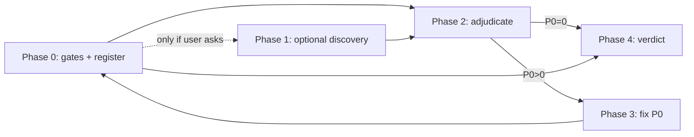

# Handoff: rag-core merge review (fresh Cursor session)

**Give this file to a new Cursor agent with no prior chat context.**  
Merge-closure review of the retrieval-core hardening slice—not another open-ended mass audit.

**Default execution path:** **Phase 0 + Phase 2 only.** Phase 1 (subagents) only if the user explicitly asks for deeper coverage or Phase 0 spot-checks fail.

**If the user says “keep going”, “continue”, or “more review”** → you are in **continuation mode** (below). Do **not** treat that as permission to re-grep deferred P1 items instead of finishing discovery.

---

## Mission (use as the session goal)

Close the **retrieval-core-hardening** slice at **`HEAD`** (expected `f9a4691`):

1. **Scope:** Review tree at **`HEAD`**. Use `git diff` only for context. No whole-repo architecture/perf audit unless a verified P0 fix touches new areas.
2. **Triage:** every candidate → **P0** | **P1** | **Rejected** | **Deferred**
3. **Remediate:** **P0 only**; minimal diffs; proportional tests
4. **Verify:** canonical gates after any code change
5. **Done when:** P0 = 0, gates green, **`docs/plans/retrieval-core-hardening-risk-register.md` updated** (≤1 page), **BLOCK / NO BLOCK**

**Max one optional discovery pass (≤6 read-only subagents) + one adjudication pass.** No third broad review unless a P0 fix regresses a VERIFIED item.

---

## Start here

```bash
cd /Users/kaanaricioglu/rag-core
git rev-parse HEAD   # expect f9a4691 — if different, stop and ask the user
git status -sb
git log -1 --oneline
```

Read:

1. `AGENTS.md`
2. `docs/plans/retrieval-core-hardening-risk-register.md` — candidates, not truth
3. `docs/providers/provider-output-shapes.md`
4. `docs/plans/2026-05-17-retrieval-core-hardening.md`

This handoff file must exist on disk at `docs/plans/cursor-agent-review-strategy.md` (commit optional).

---

## Repo snapshot (May 21, 2026)

| Item | Value |
|------|--------|
| Workspace | `/Users/kaanaricioglu/rag-core` |
| Expected baseline | **`f9a4691`** — `Close retrieval core hardening` |
| Local `main` vs `origin/main` | ahead 385, behind 1 — **`HEAD` is the review artifact** |
| Remote `origin/main` | `77ee734` `initial commit` — confirm with user before any push (history may have been rewritten) |
| Prior review | Large automated campaign; many reported findings are **stale** — adjudicate, don’t rediscover |

**Gates (re-run before claiming done):**

```bash
uv sync --group dev
uv run ruff check .
uv run mypy src tests examples
uv run pytest -q
uv build
python -m venv .wheel-smoke && . .wheel-smoke/bin/activate
pip install dist/*.whl
python -c "import rag_core"
rag-core doctor --json
```

Last known on `f9a4691`: ruff/mypy/build/wheel OK; **2071 passed**, 2 skipped.

---

## Do not repeat these mistakes

| Do not | Why |
|--------|-----|
| Open-ended “review until defensible” | Review → fix → review loop |
| 20+ parallel reviewers | Duplicates, stale findings, token burn |
| Trust subagent prose without re-reading code | False positives |
| Review while tree is still changing | Stale findings |
| Architecture / perf / TurboPuffer parity as P0 | **Deferred** only |
| Wrong workspace | Always `workdir=/Users/kaanaricioglu/rag-core` |
| Organize as “wave 2 lane N” | Use capped **phases** below |
| “Keep going” = re-read deferred P1 list only | User wants **remaining D\* scopes** (see continuation mode) |
| Claim Phase 1 done after 2–3 scopes | All **D1–D7** must be **full** or explicitly **deepen** in register |

---

## Continuation mode (“keep going” / “continue”)

**You are continuing a prior review session, not starting over.**

1. Read `docs/plans/retrieval-core-hardening-risk-register.md` → **Discovery Log** table. That table is the scope checklist.
2. List scopes marked **thin**, **missing**, or not listed → those are your **only** Phase 1 work.
3. Launch **read-only subagents in parallel** (one per remaining scope, max 6). Paste the Phase 1 `HANDOFF` block with the correct `SCOPE_BLOCK` for each.
4. **Phase 2:** adjudicate **every** subagent row (`git show` + repro). Coordinator marks verified/reproduced; subagent prose is not enough.
5. Update the register Discovery Log: set each scope to **full** | **thin** | **deepen** with finding counts.
6. Re-run gates only if you changed code (Phase 3). Continuation without fixes is register-only.

**Forbidden in continuation mode**

- Re-grepping the “P1 to re-check if time” list as the main activity
- Re-running Phase 0 P0 spot-checks unless a scope finding disputes them
- Spawning discovery for scopes already marked **full** in the register (unless user names a scope to deepen)

### Scope coverage checklist (update register when you finish a scope)

| ID | Status at last register update | Next agent action if user says “keep going” |
|----|--------------------------------|---------------------------------------------|
| D1 | **full** (packaging tests/imports/stubs) | Skip unless user asks to re-run `uv build` + `check_dist_artifacts.py` |
| D2 | **full** (CLI/config — 6 findings adjudicated) | Skip |
| D3 | **thin** (prior pass: spot-checks only) | **Run full D3** subagent + adjudicate |
| D4 | **full** (parsers — 1 PDF PUA finding) | Skip |
| D5 | **full** (search pipeline — 3 custom-telemetry P1) | Skip |
| D6 | **thin** (prior pass: allowlist re-check only) | **Run full D6** subagent + adjudicate |
| D7 | **full** (integrations/evals — LangChain content leak verified) | Skip |

After D3 + D6 are **full**, continuation discovery is **done** unless the user names a scope to deepen or a P0 fix regresses a verified item.

---

## False-positive checks (every finding)

1. Mandatory finding (prompt pressure)  
2. Stale vs current `HEAD`  
3. Doc drift without checking code/parser  
4. Hypothesis filed as P0  
5. Duplicate across scopes  
6. Wrong baseline  
7. Missing test ≠ production bug  
8. Architecture nit as merge blocker  

**Only you (coordinator)** may mark **verified** / **reproduced** after `git show`, reading code, or running a cited command.

---

## Protocol



### Phase 0 — Coordinator (default; you only)

- Confirm `HEAD`; if not `f9a4691`, ask user.
- Run gates.
- Ingest `retrieval-core-hardening-risk-register.md` → candidate ledger (`C-*` from register, `N-*` new).
- **Spot-check prior P0 claims** (list below)—verify fixed, don’t assume.
- **Skip Phase 1** only when: user did not ask for depth **and** register Discovery Log shows **all D1–D7 full** (or user accepts thin scopes).

### Phase 1 — Discovery (optional; ≤6 read-only subagents)

**Read-only. Max 8 findings each.**

```text
HANDOFF: rag-core merge review — discovery only

WORKSPACE: /Users/kaanaricioglu/rag-core
BASELINE_SHA: <output of git rev-parse HEAD>
MODE: READ-ONLY
REVIEW: tree at BASELINE_SHA; docs/providers/provider-output-shapes.md where relevant

SCOPE: <<SCOPE_BLOCK>>

FORBIDDEN: refactors, feature parity expansion, out-of-scope findings, verified without file:line + repro

OUTPUT (max 8, or "no verified findings"):
| id | severity | label | file:line | claim | repro command | false-positive check |
label: verified | reproduced | hypothesis
```

| ID | SCOPE_BLOCK |
|----|-------------|
| D1 | Packaging: `pyproject.toml`, `MANIFEST.in`, `scripts/check_dist_artifacts.py`, `__init__.py*`, search/events/integrations stubs |
| D2 | CLI/config: `cli*.py`, `cli_core_runtime.py`, `cli_provider_errors.py`, `cli_inputs.py`, `core_config_cli.py`, `config/env_access.py` |
| D3 | Ingest/security: `local_*.py`, `remote_*.py`, `archive_*.py`, `fetch*.py`, `private_files.py`, `facade/ingest_sources.py`, `remote_document_keys.py` |
| D4 | Parsers: `documents/**` — OCR, PDF, formats, figure locators |
| D5 | Search pipeline: `search/**` except `providers/*` — pipeline, context packs, filters, searcher, model-safe payloads |
| D6 | Providers: `search/providers/**`, `docs/providers/*.md` — Qdrant, TurboPuffer, memory, embeddings, rerank, `$dist`, allowlists |
| D7 | Events/evals/traces/integrations: `events/**`, `evals/**`, `cli_trace*`, `cli_eval*`, `integrations/**`, `contracts/tool_contracts.py`, `examples/**`, README/docs product claims |

**Coverage rule:** Phase 1 is incomplete until every D1–D7 row in the register is **full** or the user explicitly accepts **thin** for a scope. Partial passes (e.g. only D5/D6/D3) do not count as “discovery done”.

### Phase 2 — Adjudication (mandatory)

| Step | Action |
|------|--------|
| 1 | `git show <sha>:path` at cited line |
| 2 | Run repro command |
| 3 | Check tests |
| 4 | Dedupe |
| 5 | P0 / P1 / Rejected / Deferred |

Update `docs/plans/retrieval-core-hardening-risk-register.md` (≤1 page): P0 empty to ship, P1, Deferred, Rejected, **Discovery Log** (all D1–D7 with pass depth).

**P0 claims to verify (Phase 0 only — not a substitute for Phase 1):**

- Model-safe payloads omit `document_key` — `context_pack_models.py`, `contracts/tool_contracts.py`
- Empty `corpus_ids` allowlist — `searcher.py`; qdrant/memory/turbopuffer tests
- CLI flags override bad env — `core_config_cli.py`, `env_access.py`
- Ingest rejects symlinks/hardlinks — `private_files.py`, `facade/ingest_sources.py`

**Deferred P1 themes (do not spend “keep going” on grep-only re-check):**

These are already documented in the register if a prior pass ran D5/D7. Only re-open when a **new D-scope finding** contradicts them or user asks for a **fix**, not another discovery-less pass:

- `SearchStarted.limit` vs resolved plan limit (D5)
- Eval `expected_chunk_ids` vs `expected_grades` (D7)
- Metadata filter capability before adapter call (D5/D6)
- LangChain `as_text()` content leak (D7 — verified; fix is Phase 3 if user asks)

### Phase 3 — Fix (P0 only)

Targeted tests → full gates → no new discovery unless regression.

### Phase 4 — Close

```markdown
## Merge verdict: BLOCK | NO BLOCK
Baseline: <sha>
Gates: <one line each>
P0 open: <n>
Risk register: docs/plans/retrieval-core-hardening-risk-register.md
New verified: ...
Rejected stale: ...
```

---

## User constraints

- No commit/push unless user asks.
- No force-push `origin/main` without explicit approval.
- Do not expand `core.py` or aggregator `__init__.py` per `AGENTS.md`.

---

## Expected outcome

After prior automated review + `f9a4691` gates: **likely NO BLOCK** with P1/Deferred documented—not a second hundred-agent hunt.

## Paste to a continuing agent (zero context)

```text
Read and execute docs/plans/cursor-agent-review-strategy.md.

I am continuing a prior merge review — use Continuation mode.
Run ONLY scopes still thin/missing in docs/plans/retrieval-core-hardening-risk-register.md Discovery Log (currently: deepen D3 ingest/security and D6 providers unless register says otherwise).
Launch parallel read-only subagents per scope, adjudicate every finding, update the register.
Do not re-grep deferred P1 themes instead of finishing D scopes.
No commit unless I ask.
```
